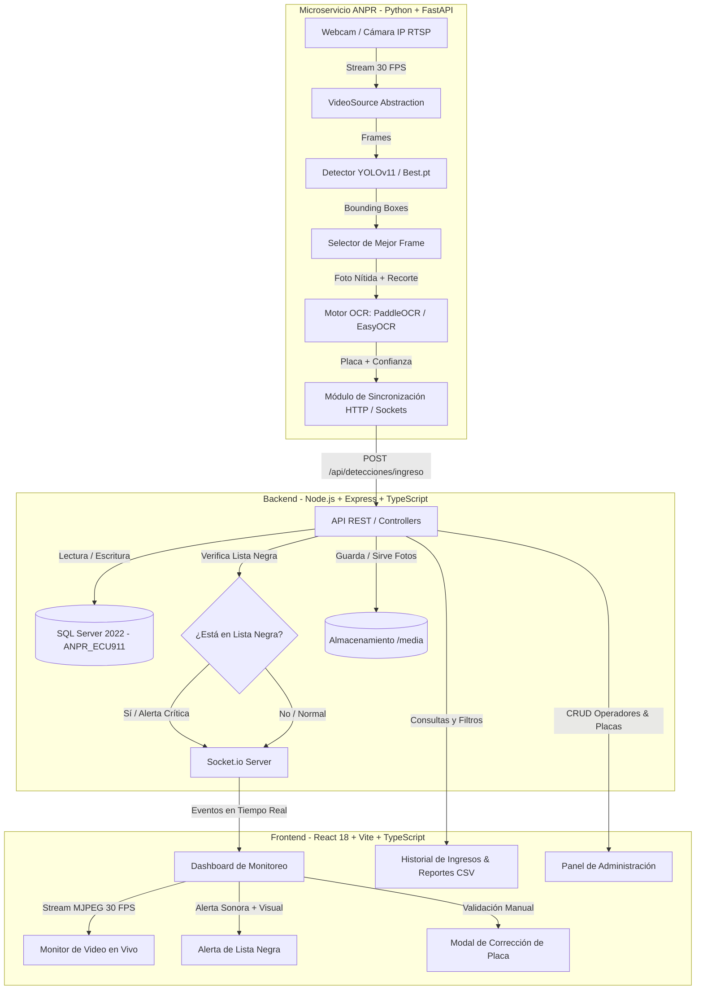

> **Documento histórico (fase 0).** La arquitectura vigente, los hallazgos del análisis de código y el
> protocolo de evaluación están en [docs/ANALISIS_ARQUITECTURA.md](docs/ANALISIS_ARQUITECTURA.md);
> roles y permisos en [docs/ROLES_Y_PERMISOS.md](docs/ROLES_Y_PERMISOS.md) y alarmas en
> [docs/NOTIFICACIONES.md](docs/NOTIFICACIONES.md).

# Arquitectura y Estado Actual del Sistema ANPR — ECU 911 Zona 3

Este documento detalla la arquitectura técnica, los modelos de Inteligencia Artificial utilizados, el flujo de datos en dos fases y la integración de microservicios desarrollada para el proyecto de titulación.

---

## 1. ¿El sistema está consumiendo YOLO en este momento?

**SÍ, de forma activa y continua en dos etapas clave:**

1. **Detección y Localización de la Placa**:
   * Utiliza el framework **Ultralytics YOLO** cargando el modelo especializado `models/license_plate_detector.pt` (y como fallback `yolo11n.pt`).
   * En cada cuadro capturado por la cámara (a 30 FPS), YOLO analiza la imagen, identifica el bounding box (coordenadas $[x_1, y_1, x_2, y_2]$) de la placa vehicular y calcula la métrica de confianza de detección (`confianza_deteccion`).

2. **Tracking Espaciotemporal y Selección del Mejor Fotograma**:
   * Los bounding boxes generados por YOLO son procesados por el algoritmo de seguimiento (**ByteTrack** / `plate_agent.py`).
   * El sistema evalúa la nitidez (mediante varianza Laplaciana) de varios cuadros consecutivos y **selecciona automáticamente la fotografía más nítida** para enviarla al reconocimiento óptico de caracteres (OCR).

---

## 2. Diagrama de la Arquitectura del Sistema



---

## 3. Arquitectura del Pipeline de Dos Fases (Two-Phase Pipeline)

Para garantizar un tiempo de respuesta menor a 2 segundos y evitar latencias o bloqueos en la cámara, el microservicio ANPR está desacoplado en dos hilos paralelos:

```
[ Cámara ] ──► ( Hilo 1: Productor @ 30 FPS ) ──► [ Cola de Inferencia ]
                                                          │
                                                          ▼
                                            ( Hilo 2: Consumidor YOLO )
                                                          │
                                                          ▼
                                            [ Selector de Mejor Frame ]
                                                          │
                                                          ▼
                                        ( Worker Asíncrono de OCR ) ──► [ Backend Node.js ]
```

1. **Fase 1: Captura Fotográfica Inmediata (Hilo Productor & Consumidor)**
   * Captura frames a 30 FPS continuos sin latencia.
   * YOLO localiza la placa en ~8–15 ms en CPU.
   * Cuando el vehículo está a la distancia y nitidez óptimas, guarda la fotografía de evidencia y notifica al backend el estado `pendiente_ocr`.

2. **Fase 2: Extracción y Corrección OCR (Worker Asíncrono)**
   * El motor OCR (EasyOCR / PaddleOCR) procesa el recorte ampliado de la placa.
   * Aplica reglas de validación para **formatos de placas ecuatorianas** (3 letras + 3 o 4 dígitos, diplomáticos, institucionales).
   * Corrige sustituciones tipográficas frecuentes (ej. `O` $\leftrightarrow$ `0`, `I` $\leftrightarrow$ `1`, `B` $\leftrightarrow$ `8`).
   * Envía el texto final y el backend emite la actualización `ingreso_actualizado` vía WebSockets.

---

## 4. Estructura de Módulos del Proyecto

```text
/ANPR
│
├── docker-compose.yml              # Orquestación de SQL Server, MediaMTX, Backend y Frontend
├── README.md                       # Guía de despliegue y credenciales
│
├── backend/                        # API REST en Node.js + Express + TypeScript
│   ├── src/
│   │   ├── config/db.ts            # Conexión resiliente a SQL Server (puertos 1433/14333)
│   │   ├── middlewares/auth.ts     # Autenticación JWT y control de roles (Admin/Operador)
│   │   ├── routes/
│   │   │   ├── auth.ts             # Login e inicio de sesión
│   │   │   ├── detecciones.ts      # Recepción de capturas del ANPR y estadísticas
│   │   │   ├── blacklist.ts        # Gestión de vehículos en lista negra
│   │   │   ├── eventos.ts          # Historial y exportación a CSV
│   │   │   └── usuarios.ts         # Gestión de cuentas de operadores
│   │   └── services/socket.ts      # Emisión de eventos en tiempo real con Socket.io
│   └── .env                        # Variables de entorno del backend
│
├── frontend/                       # Aplicación Web en React 18 + Vite + TypeScript
│   ├── src/
│   │   ├── components/             # Navbar, VideoPlayer
│   │   ├── context/AuthContext.tsx # Manejo de sesión y tokens JWT
│   │   ├── pages/
│   │   │   ├── Login.tsx           # Inicio de sesión con estética institucional
│   │   │   ├── Dashboard.tsx       # Monitoreo en vivo (Stream 30 FPS + Feed + Alertas)
│   │   │   ├── Historial.tsx       # Búsqueda con filtros, fotos y exportación CSV
│   │   │   └── AdminPanel.tsx      # Gestión de lista negra y operadores
│   │   └── styles/index.css        # Tema oscuro institucional (Navy ECU 911)
│
├── services/anpr/                  # Microservicio de IA en Python + FastAPI
│   ├── models/
│   │   └── license_plate_detector.pt # Pesos del modelo YOLO especializado en placas
│   ├── app/
│   │   ├── core/
│   │   │   ├── detector.py         # Inferencia YOLO y extracción de bounding boxes
│   │   │   ├── frame_selector.py   # Algoritmo de nitidez Laplaciana
│   │   │   ├── ocr_engine.py       # Motores OCR (EasyOCR / PaddleOCR / Tesseract)
│   │   │   └── video_source.py     # Abstracción para Webcam local o RTSP
│   │   ├── utils/plate_parser.py   # Validación y corrección de nomenclatura ecuatoriana
│   │   └── main.py                 # FastAPI app, stream MJPEG y orquestación
│   ├── media/                      # Carpeta donde se guardan las fotografías y recortes
│   └── .env                        # Configuración de cámara, OCR y umbrales YOLO
│
└── db/                             # Base de datos SQL Server
    ├── init.sql                    # Creación de tablas base y usuarios por defecto
    └── migration_deteccion_vehiculo.sql # Esquema para tracking de dos fases
```

---

## 5. Base de Datos (SQL Server)

* **`Usuarios`**: Cuentas del personal con contraseñas encriptadas con `bcrypt` (`admin` y `operator`).
* **`Camaras`**: Registro de cámaras IP del ECU 911 Zona 3 (IP `10.126.9.104`).
* **`ListaNegra`**: Placas con encargo judicial, robo o sospecha con niveles de alerta (`CRITICA`, `ALTA`, `MEDIA`).
* **`VehiculosAutorizados`**: Padrón vehicular institucional de funcionarios y directivos.
* **`DeteccionVehiculo` / `EventosIngreso`**: Registro histórico de accesos con placa leída, porcentaje de confianza YOLO/OCR, rutas de imágenes y usuario validador.

---

## 6. Resumen de Puertos y Servicios en Ejecución

| Servicio | Tecnología | Puerto | Descripción |
| :--- | :--- | :--- | :--- |
| **Frontend** | React 18 + Vite | `3000` | Interfaz gráfica de monitoreo y administración |
| **Backend API** | Node.js + Express | `5000` | API REST, lógica de negocio y WebSockets |
| **Microservicio ANPR** | Python + FastAPI | `8000` | Inferencia YOLO, OCR y Stream MJPEG de la cámara |
| **Base de Datos** | SQL Server 2022 | `14333` (Host) / `1433` (Docker) | Persistencia transaccional de eventos y usuarios |
| **Relay RTSP** | MediaMTX | `8554` / `8888` | Conversión de protocolos de video para cámaras IP |
