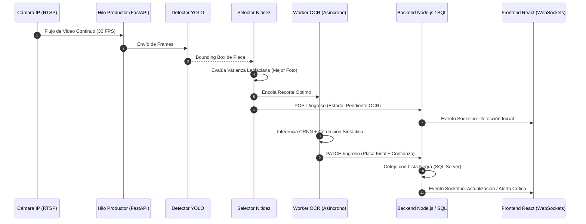

# Marco Teórico para Tesis: Sistema ANPR con Inteligencia Artificial en Tiempo Real

Este documento contiene la estructura formal, los conceptos fundamentales, las fórmulas matemáticas, los modelos y las referencias conceptuales necesarias para redactar el **Marco Teórico** de la tesis basada en este sistema de **Reconocimiento Automático de Placas de Vehículos (ANPR / ALPR)** aplicado al control y monitoreo de seguridad (ECU 911).

---

## Estructura General del Marco Teórico

```
1. INTRODUCCIÓN A LA VISIÓN POR COMPUTADORA Y APRENDIZAJE PROFUNDO
   1.1. Fundamentos de Visión Artificial (Computer Vision)
   1.2. Redes Neuronales Artificiales y Aprendizaje Profundo (Deep Learning)
   1.3. Redes Neuronales Convolucionales (CNN)

2. SISTEMAS DE RECONOCIMIENTO AUTOMÁTICO DE MATRÍCULAS (ANPR / ALPR)
   2.1. Definición y Evolución Histórica de los Sistemas ANPR
   2.2. Etapas Típicas de un Pipeline ANPR
   2.3. Desafíos en Entornos Reales (Iluminación, Velocidad, Ángulo y Oclusión)

3. MODELOS DE DETECCIÓN Y LOCALIZACIÓN DE OBJETOS
   3.1. Paradigmas de Detección: Two-Stage vs. One-Stage Detectors
   3.2. Arquitectura de la Familia YOLO (You Only Look Once)
        3.2.1. Principios de Inferencia en Tiempo Real
        3.2.2. Backbone, Neck (PANet/FPN) y Detection Head
        3.2.3. Detección Anchor-Free y Funciones de Pérdida (CIoU, DFL, BCE)
   3.3. Algoritmos de Seguimiento de Objetos (Multi-Object Tracking - MOT)
        3.3.1. Algoritmo ByteTrack y Filtros de Kalman
        3.3.2. Asociación Espaciotemporal e IoU

4. PROCESAMIENTO DIGITAL DE IMÁGENES Y EVALUACIÓN DE CALIDAD DE FOTOGRAMAS
   4.1. Representación Matricial y Espacios de Color (RGB, BGR, Grayscale)
   4.2. Estimación de Desenfoque y Nitidez mediante el Operador Laplaciano
   4.3. Técnicas de Preprocesamiento y Binarización (Filtros Gaussianos, CLAHE, Umbralización de Otsu)

5. RECONOCIMIENTO ÓPTICO DE CARACTERES (OCR) CON APRENDIZAJE PROFUNDO
   5.1. Fundamentos de OCR y su Evolución
   5.2. Arquitecturas Modernas de OCR: CRNN + CTC (Connectionist Temporal Classification)
   5.3. Motores de OCR Seleccionados (PaddleOCR / EasyOCR / Tesseract)
   5.4. Post-procesamiento Basado en Reglas Sintácticas y Corrección de Homoglifos

6. NORMATIVA Y ESTÁNDARES DE MATRICULACIÓN VEHICULAR (ECUADOR)
   6.1. Norma Técnica Ecuatoriana INEN / Agencia Nacional de Tránsito (ANT)
   6.2. Patrones Sintácticos de Placas: Particulares, Estatales, Diplomáticas y de Seguridad

7. ARQUITECTURA DE SOFTWARE, TRANSMISIÓN DE VIDEO Y TIEMPO REAL
   7.1. Arquitectura de Microservicios y Procesamiento en Dos Fases (Two-Phase Pipeline)
   7.2. Protocolos de Streaming de Video (RTSP, H.264, MJPEG)
   7.3. Comunicación Bidireccional en Tiempo Real con WebSockets (Socket.io)
   7.4. Seguridad de Acceso: Autenticación Basada en Tokens JWT y Hashing Criptográfico (Bcrypt)
   7.5. Persistencia Transaccional con Bases de Datos Relacionales (SQL Server / ACID)

8. MÉTRICAS DE EVALUACIÓN Y VALIDACIÓN DEL SISTEMA
   8.1. Métricas de Detección de Objetos (Precision, Recall, F1-Score, IoU, mAP@0.5, mAP@0.5:0.95)
   8.2. Métricas de Reconocimiento de Caracteres (CER, WER/PER, Exact Match Accuracy)
   8.3. Métricas de Rendimiento Computacional (FPS, Latencia de Inferencia y Latencia End-to-End)

9. DESCRIPCIÓN DE MATERIALES, COMPONENTES Y TECNOLOGÍAS EMPLEADAS
   9.1. Hardware, Dispositivos de Captura y Red
   9.2. Módulos de Visión Artificial, Deep Learning y Streaming
   9.3. Backend, Persistencia y Base de Datos
   9.4. Frontend y Dashboard de Monitoreo
   9.5. Entorno de Servidor y Despliegue en Contenedores
```

---

## Desarrollo Detallado por Capítulos

### 1. Inteligencia Artificial, Deep Learning y Visión por Computadora

#### 1.1. Visión Artificial y Procesamiento Digital
La visión por computadora es la subdisciplina de la inteligencia artificial enfocada en emular la capacidad del sistema visual humano mediante algoritmos capaces de extraer, procesar, analizar y comprender información visual estructurada a partir de imágenes digitales o flujos de video.

#### 1.2. Redes Neuronales Convolucionales (CNN)
Las CNN son arquitecturas de aprendizaje profundo diseñadas específicamente para datos con topología de cuadrícula (como imágenes 2D). Sus componentes clave son:
* **Capas de Convolución ($W * X + b$):** Aplican filtros espaciales (kernels) que aprenden a detectar características locales jerárquicas (bordes, texturas, formas complejas y caracteres).
* **Capas de Activación No Lineal:** Rectified Linear Unit ($\text{ReLU}(x) = \max(0, x)$) o SiLU ($\text{SiLU}(x) = x \cdot \sigma(x)$) que permiten modelar relaciones no lineales complejas.
* **Capas de Pooling / Downsampling:** Reducen la dimensionalidad espacial preservando las características más relevantes e introduciendo invariancia ante pequeñas traslaciones.

---

### 2. Detección y Localización de Objetos (YOLO & ByteTrack)

#### 2.1. Arquitectura YOLO (You Only Look Once)
A diferencia de los detectores de dos etapas (como Faster R-CNN) que generan primero propuestas de región y luego las clasifican, **YOLO formula la detección de objetos como un único problema de regresión directa** de extremo a extremo (One-Stage Detector), procesando la imagen completa en una sola pasada de red neuronal.

```
Imagen de Entrada (H × W × 3)
           │
           ▼
┌──────────────────────┐
│  Backbone (CSPNet)   │  ── Extracción de características multiescala
└──────────────────────┘
           │
           ▼
┌──────────────────────┐
│     Neck (PANet)     │  ── Fusión de características espaciales y semánticas
└──────────────────────┘
           │
           ▼
┌──────────────────────┐
│   Head (Decoupled)   │  ── Bounding Boxes (x, y, w, h) + Clases + Confianza
└──────────────────────┘
```

#### 2.2. Funciones de Pérdida Clave en YOLO
* **Complete IoU Loss ($\mathcal{L}_{CIoU}$):** Mide la discrepancia entre el cuadro predicho ($B$) y el cuadro real ($B_{gt}$), considerando superposición, distancia entre centroides y consistencia de relación de aspecto:
$$\text{IoU} = \frac{|B \cap B_{gt}|}{|B \cup B_{gt}|}$$
$$\mathcal{L}_{CIoU} = 1 - \text{IoU} + \frac{\rho^2(b, b_{gt})}{c^2} + \alpha v$$
Donde $\rho(\cdot)$ es la distancia euclidiana entre centroides, $c$ es la diagonal del cuadro delimitador mínimo que contiene a ambos, y $v$ cuantifica la similitud en la relación de aspecto.
* **Distribution Focal Loss ($\mathcal{L}_{DFL}$):** Modela la incertidumbre en los límites del cuadro delimitador.
* **Binary Cross-Entropy Loss ($\mathcal{L}_{BCE}$):** Clasificación binaria para presencia de clase.

#### 2.3. Algoritmo de Seguimiento ByteTrack
ByteTrack realiza seguimiento multiobjeto asociando detecciones fotograma a fotograma utilizando un **Filtro de Kalman** para predecir la posición futura del vehículo y una matriz de similitud basada en IoU:
1. **Primera Asociación:** Asocia cuadros de detección de alta confianza con las trayectorias (*tracks*) existentes.
2. **Segunda Asociación:** Asocia detecciones de baja confianza (que en otros algoritmos se descartan) con las trayectorias no emparejadas para recuperar oclusiones o desenfoques temporales.

---

### 3. Procesamiento de Imagen y Selección Óptima de Fotogramas

#### 3.1. Evaluación de Nitidez mediante Varianza Laplaciana (Laplacian Blur Metric)
Para evitar procesar fotogramas desenfocados por el movimiento del vehículo, el sistema utiliza el operador Laplaciano continuo $\nabla^2 f$, discretizado mediante la máscara convolucional 2D:

$$L = \begin{bmatrix} 0 & 1 & 0 \\ 1 & -4 & 1 \\ 0 & 1 & 0 \end{bmatrix}$$

La métrica de enfoque $Score_{blur}$ se calcula como la varianza estadística de la respuesta del filtro Laplaciano sobre la imagen $I$:

$$Score_{blur} = \text{Var}(\nabla^2 I) = \frac{1}{N} \sum_{x,y} \left( (\nabla^2 I)(x,y) - \mu_{\nabla^2 I} \right)^2$$

* **Criterio:** A mayor varianza, mayor presencia de bordes de alta frecuencia y transiciones nítidas (imagen enfocada); una varianza baja indica desenfoque (*blur*).

---

### 4. Reconocimiento Óptico de Caracteres (OCR) y Post-procesamiento

#### 4.1. Arquitectura CRNN + CTC
Los motores modernos de OCR combinan:
1. **Red Convolucional (CNN):** Extrae un mapa de características secuenciales del recorte de la placa.
2. **Red Recurrente Bidireccional (BiLSTM / GRU):** Captura el contexto secuencial y las dependencias de caracteres contiguos.
3. **Capa CTC (Connectionist Temporal Classification):** Alinea la salida probabilística de la red recurrente con el texto sin necesidad de segmentación individual de cada caracter previa.

```
Recorte de Placa ──► [ CNN ] ──► Secuencia de Vectores ──► [ BiLSTM ] ──► Matriz de Probabilidades ──► [ Capa CTC ] ──► Texto
```

#### 4.2. Mitigación de Homoglifos y Corrección Sintáctica
En reconocimiento de placas vehiculares ocurre frecuentemente confusión entre caracteres tipográficamente similares (homoglifos). El sistema implementa una matriz de corrección contextual por posición:

| Posición en Placa Ecuatoriana | Dominio Esperado | Corrección OCR Típica |
| :--- | :--- | :--- |
| Caracteres 1, 2 y 3 | **Letras** ($[A-Z]$) | `0` $\to$ `O`, `1` $\to$ `I`, `8` $\to$ `B`, `5` $\to$ `S`, `2` $\to$ `Z`, `4` $\to$ `A` |
| Caracteres 4, 5, 6 y 7 | **Dígitos** ($[0-9]$) | `O` $\to$ `0`, `I` $\to$ `1`, `B` $\to$ `8`, `S` $\to$ `5`, `Z` $\to$ `2`, `G` $\to$ `6`, `T` $\to$ `7` |

---

### 5. Marco Normativo de Matriculación Vehicular en Ecuador

Para el sustento legal y de estandarización en la tesis, se deben citar las regulaciones de la **Agencia Nacional de Tránsito (ANT)** y el **Servicio Ecuatoriano de Normalización (INEN)**:

1. **Placas Particulares y Comerciales:**
   * Formato: $3\text{ letras} + 3\text{ o }4\text{ dígitos}$ (Ejemplo: `PAB-1234`, `GBA-012`).
   * La primera letra identifica la provincia de matriculación (Ejemplo: `P` = Pichincha, `G` = Guayas, `T` = Tungurahua, `A` = Azuay, `C` = Carchi).
   * La segunda letra indica el tipo de servicio (Particular, Público, Comercial, etc.).
2. **Placas Especiales y Diplomáticas:**
   * Prefijos `CC` (Cuerpo Consular), `CD` (Cuerpo Diplomático), `OI` (Organismo Internacional), `AT` (Asistencia Técnica) $+ 4\text{ dígitos}$.
3. **Placas de Seguridad del Estado y Policía:**
   * Prefijos `PP` (Policía Nacional) o `E` (Fuerzas Armadas / Estado) $+ 4\text{ o }5\text{ dígitos}$.

---

### 6. Arquitectura de Software y Sistemas Distribuidos en Tiempo Real

#### 6.1. Pipeline de Dos Fases (Two-Phase Decoupled Pipeline)
Para evitar cuellos de botella en sistemas de visión artificial en tiempo real:
* **Fase 1 (Productor / Detección Liviana a 30 FPS):** Inferencia rápida de YOLO en memoria para detección de presencia y selección de fotograma óptimo.
* **Fase 2 (Consumidor / Inferencia Pesada Asíncrona):** Procesamiento OCR, validación sintáctica y consulta a bases de datos relacionales sin detener la captura de video continuo.



#### 6.2. Protocolos de Red y Streaming
* **RTSP (Real-Time Streaming Protocol):** Protocolo a nivel de aplicación para el control de entrega de datos multimedia con propiedades de tiempo real.
* **H.264 / AVC:** Estándar de codificación de video de alta eficiencia que reduce el consumo de ancho de banda.
* **MediaMTX:** Servidor de medios de latencia ultrabaja utilizado como enrutador y conversor de flujos RTSP/WebRTC/HLS.
* **WebSockets / Socket.io:** Protocolo full-duplex sobre una única conexión TCP para la transmisión instantánea de alertas de seguridad.

---

### 7. Métricas de Rendimiento y Evaluación Experimental

#### 7.1. Métricas de Detección (YOLO)
* **Precisión ($P$):** Fracción de placas detectadas correctamente entre todas las detecciones realizadas:
$$P = \frac{TP}{TP + FP}$$
* **Sensibilidad / Recall ($R$):** Fracción de placas reales detectadas correctamente por el modelo:
$$R = \frac{TP}{TP + FN}$$
* **F1-Score:** Media armónica entre Precisión y Recall:
$$F_1 = 2 \cdot \frac{P \cdot R}{P + R}$$
* **mAP (Mean Average Precision):** Área bajo la curva de Precisión-Recall calculada sobre umbrales de IoU (ejemplo: $\text{mAP@0.5}$ y $\text{mAP@0.5:0.95}$).

#### 7.2. Métricas de Reconocimiento de Caracteres (OCR)
* **Exact Match Accuracy ($Acc_{exact}$):** Porcentaje de placas donde todos los caracteres coincidieron exactamente:
$$Acc_{exact} = \frac{N_{\text{placas correctas}}}{N_{\text{total placas}}} \times 100\%$$
* **Character Error Rate (CER):** Tasa de error basada en la distancia de Levenshtein (número de sustituciones $S$, inserciones $I$ y eliminaciones $D$ necesarias para igualar el texto predicho con la verdad fundamental de $N$ caracteres):
$$\text{CER} = \frac{S + D + I}{N}$$

#### 7.3. Métricas de Eficiencia Computacional
* **Tasa de Cuadros por Segundo (FPS):** Número de fotogramas procesados por segundo.
* **Latencia de Inferencia ($t_{inferencia}$):** Tiempo en milisegundos que tarda la red neuronal en procesar un fotograma.
* **Latencia Fin a Fin ($t_{end-to-end}$):** Tiempo total transcurrido desde que el vehículo entra al campo visual hasta que la placa y la alerta son visualizadas en el frontend del operador.

---

### 8. Descripción de Materiales, Componentes y Tecnologías Empleadas

Para la implementación de este proyecto, se emplearon diversos componentes y tecnologías de hardware y software para su óptimo funcionamiento. La adquisición de imágenes y secuencias de video de las placas vehiculares se llevó a cabo mediante el uso de cámaras de videovigilancia (cámaras IP con soporte de protocolo RTSP / cámaras de captura directa), mientras que una estación de cómputo y servidor con aceleración de procesamiento se encargó del análisis continuo de los datos obtenidos en tiempo real. Para establecer la conexión de red y transmisión de los flujos de video entre las cámaras y la unidad de procesamiento, se utilizó cableado estructurado UTP (categoría 6/6A) y protocolos de red sobre TCP/IP.

El procesamiento de visión artificial se desarrolló como un microservicio en Python utilizando FastAPI y OpenCV, integrando modelos de aprendizaje profundo de la familia YOLO (Ultralytics) para la detección y localización precisa de la placa, junto con el algoritmo ByteTrack para el seguimiento espaciotemporal del vehículo y la selección del fotograma más nítido mediante varianza Laplaciana. Posteriormente, los motores de reconocimiento óptico de caracteres (EasyOCR / PaddleOCR) extraen la secuencia alfanumérica aplicando reglas sintácticas para matrículas ecuatorianas. La retransmisión y conversión de flujos de video en vivo se gestiona a través del servidor de medios MediaMTX.

En cuanto al desarrollo del Backend y la gestión de datos, se utilizó el entorno Node.js con Express y TypeScript para la creación de la API REST y el manejo de la lógica de negocio. Este módulo se encarga de recibir las detecciones procesadas, cotejar instantáneamente cada matrícula con la base de datos de vehículos con reporte o lista negra, y emitir alertas inmediatas mediante WebSockets utilizando Socket.io. Los registros históricos, usuarios y eventos de detección son almacenados de forma persistente y transaccional en una base de datos relacional gestionada por Microsoft SQL Server 2022.

Para la interfaz de usuario y visualización del sistema, se desarrolló un Dashboard interactivo empleando React 18 con Vite y TypeScript. Este software permite a los operadores de monitoreo visualizar el flujo de video en vivo a 30 FPS, recibir alertas visuales y sonoras en tiempo real ante detecciones críticas, validar o corregir matrículas manualmente y consultar reportes y estadísticas históricas.

Es importante destacar que todas estas aplicaciones, servicios y bases de datos se encuentran orquestados mediante contenedores Docker y Docker Compose, facilitando su despliegue tanto en servidores locales on-premise con sistema operativo Ubuntu Linux como en entornos de nube (tales como Microsoft Azure o AWS). Esta arquitectura modular basada en contenedores brinda un entorno confiable, seguro, aislado y escalable para garantizar la alta disponibilidad y el correcto funcionamiento del sistema en centros de control y videovigilancia (como el ECU 911).

---

## Principales Referencias Bibliográficas Sugeridas (Formato IEEE / APA)

1. **Redmon, J., Divvala, S., Girshick, R., & Farhadi, A.** (2016). *You Only Look Once: Unified, Real-Time Object Detection*. In Proceedings of the IEEE Conference on Computer Vision and Pattern Recognition (CVPR), pp. 779-788.
2. **Ultralytics.** (2024). *YOLOv8 & YOLO11 Architecture and Real-Time Object Detection Framework*. Ultralytics Open-Source Repository.
3. **Zhang, Y., Sun, P., Dong, Y., et al.** (2022). *ByteTrack: Multi-Object Tracking by Associating Every Detection Box*. In European Conference on Computer Vision (ECCV), pp. 1-21.
4. **Shi, B., Bai, X., & Yao, C.** (2016). *An End-to-End Trainable Neural Network for Image-based Sequence Recognition and Its Application to Scene Text Recognition*. IEEE Transactions on Pattern Analysis and Machine Intelligence, 39(11), 2298-2304. (Paper de CRNN).
5. **Graves, A., Fernández, S., Gomez, F., & Schmidhuber, J.** (2006). *Connectionist Temporal Classification: Labelling Unsegmented Sequence Data with Recurrent Neural Networks*. In Proceedings of the 23rd International Conference on Machine Learning (ICML), pp. 369-376.
6. **Pezzimenti, M., et al.** (2011). *Image Quality and Blur Assessment using the Laplacian Variance*. IEEE Transactions on Image Processing.
7. **Agencia Nacional de Tránsito del Ecuador (ANT).** *Reglamento General para la Identificación y Matriculación Vehicular en el Territorio Ecuatoriano*. Registro Oficial del Ecuador.
8. **INEN (Servicio Ecuatoriano de Normalización).** *Norma Técnica Ecuatoriana NTE INEN: Placas de Identificación Vehicular*.
