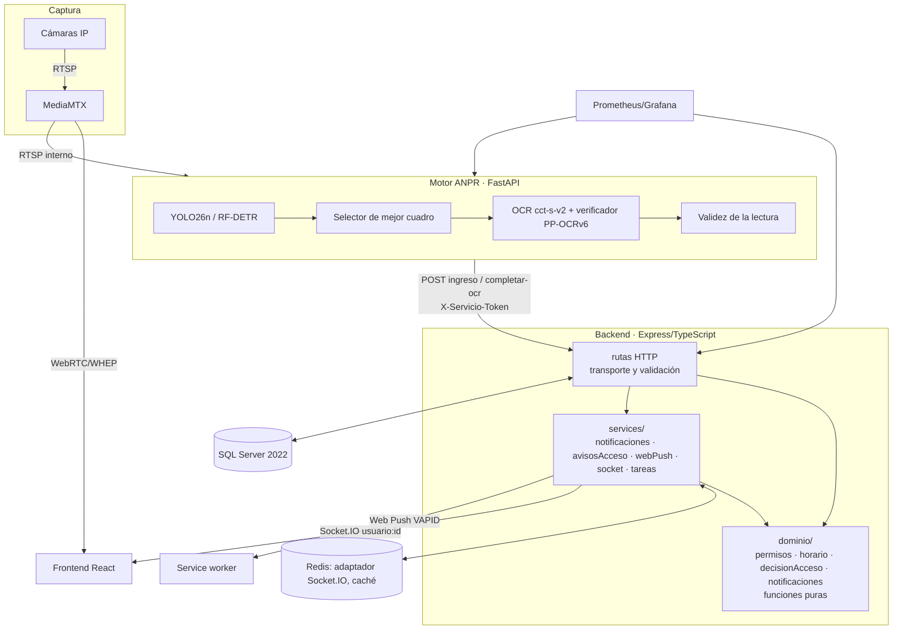

# Análisis de arquitectura y código · Sistema ANPR ECU 911 (versión 5)

Documento base para la sección de **materiales y métodos** del artículo: qué se analizó, qué se
encontró, qué se cambió y por qué, cómo se compara con el estado del arte y cómo se evalúa.

## 0. Resumen

| Aspecto | Antes (fase 2) | Ahora (v5) |
|---|---|---|
| Roles | 3, con ~20 listas de roles repartidas en rutas y pantallas | 4 (nuevo **Gestor de accesos**) con matriz RBAC única por permisos y SoD |
| Permisos de placa | Padrón con fecha de vencimiento | Categoría, vigencia desde/hasta y **franjas horarias** (TRBAC); restricción explicada en cada paso |
| Decisión de acceso | Embebida en el handler HTTP | Política pura con tabla de decisión R1–R7 y prueba de propiedad de seguridad |
| Notificaciones | Avisos efímeros por Socket.IO (difusión global) | Centro de alarmas persistente: Socket.IO por usuario + adaptador Redis, Web Push VAPID, ACK, escalamiento, supresión de avalanchas, métricas ISA-18.2 |
| Solicitudes de acceso | — | Operador → Gestor con separación de funciones |
| Migraciones | Re-ejecutadas en cada arranque sobre la conexión a `master` | Registradas con SHA-256 sobre la base de destino |
| Pruebas backend | 36/57 (21 fallaban) | **191/191** + prueba E2E en SQL Server real + benchmark |
| Latencia de notificación (laboratorio) | no medida | p50 31,5 ms · p95 40,3 ms · 100 % de entrega (n = 200) |

## 1. Método

1. **Revisión estática** de los tres servicios: backend (Express/TypeScript, 5,5 k líneas), frontend
   (React/TypeScript, 6,8 k) y motor ANPR (FastAPI/Python, 9,6 k), base de datos (15 scripts T-SQL),
   orquestación (Docker Compose, Prometheus, Grafana, MediaMTX) y CI.
2. **Línea base ejecutable:** compilación (`tsc`), pruebas (`jest`) y build (`vite`) antes de cambiar nada.
3. **Prueba de extremo a extremo** sobre SQL Server 2022 y Redis 7 reales: se creó una base con el
   código anterior (commit `2df86cc`) y se arrancó el backend nuevo sobre ella para validar la migración
   de una instalación existente; luego 41 verificaciones funcionales por API y Socket.IO, y recorrido de
   la interfaz con Chromium (Playwright) para los roles Gestor, Operador y Supervisor.
4. **Benchmark** del canal de notificaciones y verificación de escalado horizontal (dos instancias).

## 2. Arquitectura



**Capas del backend (arquitectura limpia; detalle en `docs/ARQUITECTURA_LIMPIA.md`):**

- `src/dominio/` — reglas del negocio sin E/S: matriz RBAC (`permisos.ts`), validación de lo que
  escribe una persona (`validacion.ts`), restricciones temporales (`horario.ts`), política de
  decisión (`decisionAcceso.ts`), catálogo de alarmas (`notificaciones.ts`) y métricas de
  evaluación (`evaluacion.ts`).
- `src/aplicacion/` — casos de uso de cada módulo con sus puertos (interfaces).
- `src/infraestructura/` — repositorios SQL Server, sesiones, Socket.IO, Web Push, correo,
  MediaMTX, motor ANPR, métricas y tareas programadas.
- `src/interfaz/http/` — routers finos (sesión, permiso, caso de uso, respuesta) y catálogo OpenAPI.
- `src/contenedor/` — raíz de composición; `src/app.ts` — aplicación Express; `src/index.ts` — arranque.
- `src/tests/arquitectura.test.ts` — prueba de aptitud que hace cumplir la regla de dependencias.

## 3. Hallazgos

Severidad: **A** alta (correctitud/seguridad), **M** media (mantenibilidad/operación), **B** baja.

### 3.1 Corregidos en esta versión

| ID | Sev. | Hallazgo | Corrección |
|---|---|---|---|
| H1 | M | Autorización por listas de roles repetidas en ~20 sitios (rutas y pantallas); agregar un rol exigía tocarlos todos. | Matriz única `dominio/permisos.ts`, `requierePermiso()` en la API y `puede()` en la interfaz; 52 casos de integración rol × endpoint. |
| H2 | A | El esquema y las migraciones se ejecutaban sobre el pool conectado a `master`, confiando en que el `USE` de `init.sql` persistiera en la misma conexión del pool (no garantizado). | `infraestructura/db.ts:85`: solo `CREATE DATABASE` en master; todo el esquema sobre un pool de la base de destino; se eliminan los `USE` (además permite otro `DB_NAME`). |
| H3 | M | Todas las migraciones se re-ejecutaban en cada arranque, sin registro de qué se aplicó. | Tabla `SchemaMigraciones` con suma SHA-256 (`infraestructura/db.ts:38`); verificado: 0 re-ejecuciones al reiniciar. |
| H4 | B | Separador de lotes `\bGO\b` en cualquier posición del texto. | `lotesSql()` separa por `GO` en su propia línea, como `sqlcmd`; probado contra los 15 scripts. |
| H5 | M | Métricas HTTP etiquetadas con `req.path` (una serie por id: explosión de cardinalidad) y el gauge "en curso" se incrementaba y decrementaba con etiquetas distintas, por lo que nunca volvía a cero. | `rutaNormalizada()` (`infraestructura/servicios/metrics.ts:189`) y etiqueta fijada al inicio; prueba dedicada. |
| H6 | M | 21 de 57 pruebas del backend fallaban (obsoletas: `prom-client` v15 asíncrono, mocks de caché mal tipados, integración sin rutas montadas, login con el esquema v1). | Pruebas reescritas; suite 191/191. |
| H7 | M | La política de autorización (≈130 líneas) estaba mezclada con SQL y difusión en el handler `completar-ocr`, imposible de probar aisladamente. | `dominio/decisionAcceso.ts:89` (tabla R1–R7) con prueba de propiedad: nunca se autoriza sin permiso vigente (360 combinaciones). |
| H8 | M | Un permiso vencido se trataba como "vehículo no registrado", sin explicación para el personal. | `restriccion_acceso` (`fuera_horario`/`no_iniciada`/`vencida`) con motivo concreto y notificación al gestor. |
| H9 | B | La tarjeta de pendientes mostraba "En padrón · confirme la placa" también para placas sin permiso con lectura dudosa. | Texto según el caso real (`frontend/src/interfaz/componentes/deteccion.tsx`). |
| H10 | M | Motor ANPR: los registros `_captured_commit_ids` y `_ocr_last_attempt` crecían sin límite en operación 24/7 (fuga de memoria lenta). | `app/dominio/memoria.py` purga los tres registros; pruebas con crecimiento acotado. |
| H11 | M | `index.ts` construía la aplicación y abría el puerto en el mismo módulo: no había forma de probar las rutas reales. | `app.ts` (composición) separado de `index.ts` (arranque). |
| H12 | A | Redis publicado en todas las interfaces sin contraseña (`6379:6379`). | Publicado solo en `127.0.0.1`. |
| H13 | M | Un cambio de rol o un bloqueo no afectaba a las conexiones Socket.IO abiertas (salas por rol obsoletas). | `alInvalidarCuenta()` cierra las conexiones de la cuenta. |
| H14 | M | Tiempo real solo por difusión global: sin salas por usuario ni reparto entre instancias. | Salas `usuario:{id}` y adaptador Redis (verificado con dos instancias). |
| H15 | B | Fechas de vigencia interpretadas en la hora local del contenedor (`T00:00:00`). | Interpretación explícita en UTC para columnas `DATE`. |
| H19 | A | La documentación describía el detector como YOLO26n, pero el modelo cargado era YOLOv8n (Koushim, Hugging Face); si faltaba el archivo, el servicio cargaba sin aviso `yolo11n` COCO, que no tiene la clase placa. | YOLO26n afinado en Open Images V7 (5 362 imágenes de entrenamiento) promovido a producción: F1 0.873 frente a 0.611 en 2 048 imágenes de prueba (McNemar p ≈ 1.7 × 10⁻²¹³), igual latencia con OpenVINO. Verificación de la arquitectura al arrancar y en `/status`; prueba automática; sin respaldo COCO. Detalle en `services/anpr/models/MODEL_CARD.md`. |
| H18 | M | El CD fallaba en cada push a `main`: secretos de Kubernetes y carpeta `k8s/` inexistentes, `npm run migrate` sin script (el backend migra al arrancar), respaldo y restauración con `pg_dump`/`psql` sobre una base SQL Server, e imágenes de desarrollo (`vite dev`, `ts-node-dev`, `--reload`) sin los scripts `db/` en el backend. | CD tras CI verde (`workflow_run`): imágenes de producción en GHCR etiquetadas por commit; manifiestos Kustomize (base + staging/producción); despliegue omitido con aviso sin kubeconfig; respaldo `BACKUP DATABASE … WITH CHECKSUM`, rollouts, smoke tests y rollback automático de Deployments. Verificado: imagen del backend contra SQL Server 2022 (esquema y 13 migraciones), `BACKUP DATABASE`, imagen del frontend (mismo origen, caché), `kubeconform` (17 objetos por entorno) y `actionlint`. |
| H17 | A | Trivy reportaba 12 vulnerabilidades altas con corrección disponible: axios 1.19.0 (frontend; SSRF y DoS), engine.io 6.6.9 (backend; DoS), python-multipart 0.0.20 (motor; escritura arbitraria por *path traversal* y DoS) y python-socketio 5.13.0 (motor; DoS). | axios 1.20.0, engine.io 6.6.11, python-multipart 0.0.30, python-socketio 5.16.2; Trivy: 0 altas/críticas. Verificado: 191 pruebas del backend, build del frontend, 63 pruebas del motor y subida `UploadFile` de FastAPI. |
| H16 | M | CI en rojo en `main`: (a) `upload-sarif` sin permisos y sin GitHub Advanced Security (repositorio privado); (b) `tests/archive/` sin paquete interrumpía la recolección de las 63 pruebas del motor; (c) una prueba del validador contradecía su contrato documentado (`sanitize` elimina símbolos); (d) imágenes Docker etiquetadas con un secreto inexistente. | Permisos del job y umbral propio de Trivy (falla ante vulnerabilidades críticas corregibles; informe SARIF como artefacto); `services/anpr/pytest.ini`; prueba alineada al contrato; el CI construye las imágenes de producción sin publicarlas (la publicación la hace el CD, H18). |

### 3.2 Recomendaciones (no aplicadas; justificación)

| ID | Sev. | Hallazgo | Recomendación |
|---|---|---|---|
| R1 | M | `services/anpr/app/main.py` (1 339 líneas) y `core/detector.py` (1 522) concentran estado global mutable, hilos, HTTP y reglas. | Dividir en paquetes (captura, inferencia, publicación de eventos) con inyección de dependencias. Hacerlo con el conjunto de regresión de `docs/EXPERIMENTO_MODELOS.md` para no degradar la exactitud. |
| R2 | M | Comparaciones no SARGables `REPLACE(REPLACE(placa,'-',''),' ','') = @placa` (`infraestructura/persistencia/deteccionesSql.ts`, `infraestructura/servicios/plateMatching.ts`, `infraestructura/persistencia/listasSql.ts`): no usan índice. | Columna calculada persistida `placa_normalizada` con índice en cada tabla. |
| R3 | B | `findBlacklistMatch` (`infraestructura/servicios/plateMatching.ts:71`) lee toda la lista de alertas por evento (O(n)). | Aceptable con n < 10⁴; para más, caché en memoria invalidada con `listas:actualizadas`. |
| R4 | B | Ventana de deduplicación de 35 s duplicada en el motor (`PLATE_DEBOUNCE_SECONDS`) y en el backend (`dominio/detecciones.ts`, `VENTANA_MISMO_PASO_S`). | Parámetro único configurable. |
| R5 | M | Reproducibilidad: dependencias sin fijar (`ultralytics>=8.4`, `numpy>=1.26`, `onnxruntime>=1.18`) e imágenes `latest` (SQL Server, Prometheus, Grafana). | Archivo de bloqueo (pip-tools/uv) e imágenes por versión o digest; imprescindible para replicar el experimento. |
| R6 | B | Pesos `.pt` versionados en git (~18 MB). | Git LFS o DVC, con hash en `MODEL_CARD.md`. |
| R7 | B | Código archivado (`core/archive/`, `tests/archive/`) y `backend/tests/auth.test.ts` fuera de las raíces de Jest con un secreto embebido. | Resuelto: eliminados junto con el resto del código sin uso (2026-10-05). |
| R8 | M | `docker-compose.yml` es de desarrollo (`uvicorn --reload`, `NODE_ENV=development`, código montado como volumen). | `docker-compose.prod.yml` con imágenes construidas, sin volúmenes de código y con TLS en un proxy (requisito de Web Push fuera de localhost). |
| R9 | M | JWT en `sessionStorage`, accesible ante un XSS. | Cookie `httpOnly`+`SameSite=Strict` con token anti-CSRF y CSP estricta. |
| R10 | B | Caché de cuentas de 20 s por instancia (`interfaz/http/middlewares/auth.ts:43`): con varias instancias, un bloqueo tarda hasta 20 s en las demás. | Invalidación por Redis pub/sub. |
| R11 | B | CI: `eslint` sin configuración (el paso siempre se omite); las pruebas Python requieren todas las dependencias de visión. | Configurar ESLint; marcar pruebas puras para ejecutarlas sin modelos. |
| R12 | B | 80 bloques `except Exception` en el motor. | Capturar excepciones específicas y contarlas en Prometheus. |

## 4. Decisiones de diseño (registro de decisiones)

**ADR-1 · RBAC por permisos con SoD.** Se descartó ABAC completo (NIST SP 800-162) por su costo de
gobierno para cuatro roles; RBAC con permisos finos cubre los requisitos y deja abierta la evolución a
atributos (la regla temporal ya es un atributo del recurso). La SoD dinámica impide que una misma
persona solicite y apruebe un acceso.

**ADR-2 · Restricciones temporales tipo TRBAC.** Las franjas son periódicas semanales con cruce de
medianoche, evaluadas en la zona institucional; es el modelo de los "perfiles horarios" de los sistemas
de control de acceso, con semántica formal en TRBAC (Bertino et al., 2001).

**ADR-3 · Política de decisión pura con costos asimétricos.** Falso autorizado ≫ falsa alerta: la
autorización automática exige coincidencia exacta, permiso vigente y evidencia de lectura; la lista de
alertas se cruza con tolerancia a homoglifos y nunca se rebaja. La propiedad de seguridad
"`autorizado ⇒ permiso vigente`" se verifica exhaustivamente sobre el espacio de entradas discretizado.

**ADR-4 · Socket.IO + Web Push en lugar de SignalR.** Detalle en [NOTIFICACIONES.md](NOTIFICACIONES.md):
SignalR requiere un servidor .NET; Socket.IO ofrece las mismas abstracciones en Node.js y el adaptador
Redis cumple el papel del backplane. Web Push estándar cubre la entrega con la pestaña cerrada sin
depender de un proveedor privativo.

**ADR-5 · Guardar antes de emitir y reconocimiento global.** La bandeja persistente convierte un canal
"como máximo una vez" (WebSocket) en "al menos una vez" con deduplicación por id; el ACK global evita
que varias personas atiendan la misma alarma y permite medir el tiempo de reconocimiento.

**ADR-6 · Migraciones registradas.** Trazabilidad del esquema (qué versión de cada script se aplicó y
cuándo), al estilo de Flyway, sin agregar dependencias.

## 5. Estado del arte

### 5.1 Sistemas profesionales de ANPR para control de acceso

Comparación por capacidades descritas en la documentación pública de cada fabricante (nivel funcional,
no de implementación):

| Capacidad | Genetec AutoVu | Milestone XProtect LPR | Nedap ANPR Access | Hikvision ANPR | Rekor/OpenALPR | **Este sistema** |
|---|:-:|:-:|:-:|:-:|:-:|:-:|
| Lista de alertas (hotlist / blocklist) | ✓ | ✓ (match lists) | ✓ | ✓ | ✓ | ✓ (tolerante a homoglifos) |
| Lista de permitidos con vigencia | ✓ (permisos) | ✓ | ✓ | ✓ | ✓ | ✓ (desde/hasta) |
| Perfiles horarios por permiso | ✓ | ✓ (vía eventos/reglas) | ✓ (vía control de acceso) | ✓ | parcial | ✓ (franjas TRBAC) |
| Flujo de solicitud/aprobación de visitas | integraciones | integraciones | vía sistema de acceso | — | — | ✓ (con SoD) |
| Alarmas con reconocimiento y escalamiento | ✓ (Security Center) | ✓ (Alarm Manager) | vía sistema de acceso | parcial | webhooks | ✓ (ISA-18.2) |
| Notificación fuera de la consola | app/correo | app/correo | — | app | webhooks/correo | Web Push estándar + correo |
| Segundo factor (marca/color) | parcial | — | — | parcial | ✓ (atributos) | ✓ |
| Métricas de evaluación científica (IC, McNemar, TTA) | — | — | — | — | — | ✓ |

Aporte diferencial para el artículo: una arquitectura **abierta y reproducible** que integra decisión
con costos asimétricos y evidencia de lectura, permisos temporales formalizados, gestión de alarmas
según ISA-18.2 y un protocolo de evaluación con intervalos de confianza.

### 5.2 Literatura

- **ANPR con aprendizaje profundo:** detección y reconocimiento en escenarios no controlados
  (Silva & Jung, 2018) y sistemas en tiempo real basados en YOLO independientes del diseño de placa
  (Laroca et al., 2018, 2021). La validez de la lectura y el consenso multi-cuadro del motor siguen
  esta línea (ver [METODO_VERIFICACION_LECTURA.md](METODO_VERIFICACION_LECTURA.md)).
- **Control de acceso:** RBAC (Sandhu et al., 1996; Ferraiolo et al., 2001), RBAC temporal
  (Bertino et al., 2001; Joshi et al., 2005), ABAC (Hu et al., 2014).
- **Sistemas orientados a eventos:** publicación/suscripción (Eugster et al., 2003), WebSocket
  (RFC 6455), Web Push (RFC 8030/8291/8292).
- **Gestión de alarmas y fatiga:** ANSI/ISA-18.2-2016, IEC 62682, EEMUA 191; fatiga de alarmas en
  entornos de vigilancia continua (Sendelbach & Funk, 2013).

## 6. Protocolo de evaluación y resultados

### 6.1 Correctitud

| Nivel | Artefacto | Resultado |
|---|---|---|
| Dominio | `src/tests/dominio/*` (RBAC, horario, decisión, alarmas) | 56 pruebas; propiedad de seguridad sobre 360 combinaciones |
| Orquestación | `src/tests/services/notificaciones.test.ts` (puertos simulados) | guardar-antes-de-emitir, supresión, exclusión SoD, push y depuración |
| Integración HTTP | `src/tests/integration/api.test.ts` | 52 casos rol × endpoint (401/403/acceso) + salud, métricas y bandeja |
| Esquema | `src/tests/config/migraciones.test.ts` | 15 scripts sin `USE`/`CREATE DATABASE` |
| Extremo a extremo | SQL Server 2022 + Redis 7 reales | migración de una base existente; 41 verificaciones (R2, R5, R6, R7, enrutamiento por permiso, ACK, SoD, excepción, escalamiento, push, métricas) |
| Interfaz | Chromium (Playwright), roles Gestor/Operador/Supervisor | sin errores de página; flujo garita → solicitud → aprobación → aviso verde |

### 6.2 Desempeño del canal de notificaciones (laboratorio)

Entorno: contenedor Linux, Node.js 22, SQL Server 2022 Developer y Redis 7 en Docker, adaptador Redis
activo; sin inferencia de video (se aísla el subsistema decisión → notificación). 200 pasos sin permiso.

| Entrega | Media | p50 | p95 | p99 | Máx. |
|---:|---:|---:|---:|---:|---:|
| 100 % (200/200) | 33,2 ms | 31,5 ms | 40,3 ms | 61,4 ms | 71,1 ms |

Escalamiento (umbral 20 s, barrido 15 s): escalada a los 34 s, dentro de la cota umbral + 15 s.
Escalado horizontal: notificación originada en la instancia A entregada a un cliente de la instancia B.

### 6.3 Indicadores para la evaluación en campo

| Hipótesis | Indicador | Criterio |
|---|---|---|
| H1: la alerta llega al personal en tiempo operativo | p95 de `anpr_notificacion_latencia_seconds` (captura → notificación) | < 1 s |
| H2: la supresión reduce la carga de alarmas | alarmas/h por operador con y sin supresión (`repeticiones_agrupadas`) | ≈ 6/h en régimen estable; sin ventanas > 10 alarmas/10 min |
| H3: ninguna alarma crítica queda sin atender | tasa de escalamiento y TTA p95 por prioridad | escaladas → 0 con dotación adecuada |
| H4: la política no concede accesos indebidos | tasa de falsa aceptación (`Evaluación del sistema`) con IC 95 % de Wilson | FAR → 0; comparación de configuraciones con McNemar |

**Amenazas a la validez:** el benchmark no incluye la inferencia ni la red de la institución (la latencia
total = inferencia + OCR + este canal); el TTA depende de la dotación y del turno; las métricas de
campo deben reportarse por periodo y cámara con sus intervalos de confianza.

## 7. Reproducir

```bash
# Pruebas del backend (191) y build del frontend
cd backend && npm ci && npm test
cd ../frontend && npm ci && npm run build
# Pruebas puras del motor
cd ../services/anpr && pytest tests/test_memoria.py
# Sistema completo y benchmark del canal
docker compose up --build
cd backend && node scripts/benchmark_notificaciones.js --api http://localhost:5000 \
  --servicio "$ANPR_SERVICE_TOKEN" --email <cuenta con avisos:acceso> --password '…' --muestras 200 --csv latencias.csv
```

## Referencias

- Bertino, E., Bonatti, P. A., & Ferrari, E. (2001). TRBAC: A temporal role-based access control model. *ACM TISSEC, 4*(3), 191–233.
- Cockburn, A. (2005). *Hexagonal architecture (Ports and Adapters)*.
- Eugster, P. T., Felber, P. A., Guerraoui, R., & Kermarrec, A.-M. (2003). The many faces of publish/subscribe. *ACM Computing Surveys, 35*(2), 114–131.
- Ferraiolo, D. F., Sandhu, R., Gavrila, S., Kuhn, D. R., & Chandramouli, R. (2001). Proposed NIST standard for role-based access control. *ACM TISSEC, 4*(3), 224–274.
- Fette, I., & Melnikov, A. (2011). *The WebSocket Protocol* (RFC 6455). IETF.
- Hu, V. C., Ferraiolo, D., Kuhn, R., et al. (2014). *Guide to Attribute Based Access Control (ABAC) Definition and Considerations* (NIST SP 800-162).
- International Society of Automation (2016). *ANSI/ISA-18.2-2016 Management of Alarm Systems for the Process Industries*.
- Joshi, J. B. D., Bertino, E., Latif, U., & Ghafoor, A. (2005). A generalized temporal role-based access control model. *IEEE TKDE, 17*(1), 4–23.
- Laroca, R., Severo, E., Zanlorensi, L. A., et al. (2018). A robust real-time automatic license plate recognition based on the YOLO detector. *IJCNN 2018*.
- Laroca, R., Zanlorensi, L. A., Gonçalves, G. R., et al. (2021). An efficient and layout-independent automatic license plate recognition system based on the YOLO detector. *IET Intelligent Transport Systems, 15*(4), 483–503.
- Sandhu, R. S., Coyne, E. J., Feinstein, H. L., & Youman, C. E. (1996). Role-based access control models. *IEEE Computer, 29*(2), 38–47.
- Sendelbach, S., & Funk, M. (2013). Alarm fatigue: A patient safety concern. *AACN Advanced Critical Care, 24*(4), 378–386.
- Silva, S. M., & Jung, C. R. (2018). License plate detection and recognition in unconstrained scenarios. *ECCV 2018*, 580–596.
- Thomson, M., Damaggio, E., & Raymor, B. (2016). *Generic Event Delivery Using HTTP Push* (RFC 8030); Thomson, M. (2017). *Message Encryption for Web Push* (RFC 8291); Thomson, M., & Beverloo, P. (2017). *Voluntary Application Server Identification (VAPID) for Web Push* (RFC 8292).
