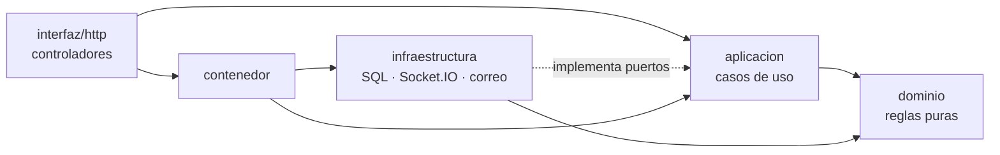

# Arquitectura limpia (backend, frontend y motor ANPR)

El backend sigue la **arquitectura limpia** (Martin, 2017), una variante de la arquitectura
hexagonal (puertos y adaptadores, Cockburn, 2005). La regla de dependencias es una sola: **el código
apunta hacia adentro**. El dominio no conoce nada de afuera, la aplicación solo conoce el dominio y
sus propios puertos, y Express, SQL Server, Socket.IO o el correo son detalles intercambiables.

La regla no depende de la disciplina de quien programa: la prueba de aptitud
`backend/src/tests/arquitectura.test.ts` lee las importaciones de cada archivo y falla si una capa
interna depende de una externa (se verificó introduciendo violaciones a propósito).

```
backend/src/
├── dominio/                 Reglas puras: validaciones, decisiones y cálculos (sin E/S ni process.env)
├── aplicacion/              Casos de uso + puertos (interfaces) que necesitan; comun.ts (errores, Actor)
├── infraestructura/         Adaptadores que implementan los puertos
│   ├── persistencia/        Repositorios SQL Server, uno por módulo
│   ├── servicios/           Socket.IO, Web Push, correo, MediaMTX, motor ANPR, métricas, configuración…
│   ├── adaptadores.ts       Auditoría (solo inserción) y eventos en tiempo real
│   ├── sesiones.ts          JWT y estado vigente de las cuentas
│   ├── db.ts                Conexión y migraciones versionadas
│   └── logger.ts
├── interfaz/http/           Entrada HTTP: HTTP → caso de uso → HTTP
│   ├── rutas/               Un router por módulo (controladores finos)
│   ├── middlewares/         Sesión, permisos y token del servicio ANPR
│   ├── docs/                Catálogo OpenAPI 3.0.3 (Swagger) generado desde las rutas
│   ├── respuesta.ts         controlador(), actorDe(), idDe(): traducción de errores a HTTP
│   └── peticion.ts          IP de origen
├── contenedor/              Raíz de composición: conecta casos de uso con adaptadores (uno por módulo)
├── tests/                   Pruebas por capa (dominio, aplicacion, infraestructura, interfaz, api, integration)
├── app.ts                   Aplicación Express (sin efectos secundarios)
└── index.ts                 Arranque: base de datos, Socket.IO, tareas programadas
```



## Reglas por capa (verificadas por `tests/arquitectura.test.ts`)

| Capa | Puede importar | No puede importar | Contiene |
|---|---|---|---|
| `dominio/` | solo `dominio/` | paquetes, E/S, `process.env` | tipos, reglas, validaciones (`validacion.ts`), decisión de acceso (`decisionAcceso.ts`), métricas de evaluación |
| `aplicacion/` | `dominio/`, `aplicacion/` | Express, mssql, `infraestructura/`, `process.env` | casos de uso (`casosX(deps)`), puertos (`interface RepositorioX`), errores (`ErrorAplicacion`) |
| `infraestructura/` | `dominio/`, tipos de `aplicacion/`, mssql, Socket.IO… | Express, `interfaz/`, `contenedor/` | repositorios SQL, adaptadores de auditoría, eventos, sesiones, servicios externos |
| `interfaz/http/` | `aplicacion/`, `dominio/`, `contenedor/` | `infraestructura/`, mssql, consultas SQL | routers: leer `req`, llamar al caso de uso, responder |
| `contenedor/` | todo | — | `export const x = casosX({ repositorio: repositorioXSql, auditoria: auditoriaSql, … })` |

## Módulos

| Módulo | Casos de uso | Rutas | Reglas propias del dominio |
|---|---|---|---|
| Listas (blanca y negra) | `aplicacion/listas.ts` | `/api/vehiculos-autorizados`, `/api/blacklist` | `dominio/listas.ts`, `horario.ts` |
| Solicitudes de acceso | `aplicacion/solicitudesAcceso.ts` | `/api/solicitudes-acceso` | `dominio/solicitudesAcceso.ts` (SoD, versión) |
| Detecciones | `aplicacion/detecciones.ts` | `/api/detecciones` | `dominio/detecciones.ts`, `decisionAcceso.ts` |
| Cámaras, monitoreo, medios | `aplicacion/camaras.ts`, `monitoreo.ts`, `medios.ts` | `/api/camaras`, `/api/monitoreo`, `/api/medios` | `dominio/camaras.ts` |
| Usuarios y autenticación | `aplicacion/usuarios.ts`, `auth.ts` | `/api/usuarios`, `/api/auth` | `dominio/usuarios.ts`, `permisos.ts` |
| Auditoría (inmutable) | `aplicacion/auditoria.ts` | `/api/auditoria` | `dominio/auditoria.ts` |
| Configuración | `aplicacion/configuracion.ts` | `/api/configuracion` | `dominio/configuracion.ts` |
| Panel de inicio | `aplicacion/panel.ts` | `/api/panel` | — |
| Reportes | `aplicacion/reportes.ts` | `/api/reportes` | `dominio/periodo.ts` |
| Evaluación científica | `aplicacion/evaluacion.ts` | `/api/evaluacion` | `dominio/evaluacion.ts`, `periodo.ts` |
| Notificaciones | `aplicacion/notificaciones.ts` | `/api/notificaciones` | `dominio/notificaciones.ts`, `suscripcionPush.ts` |
| Consulta de propietario | `aplicacion/propietario.ts` | `/api/propietario` | `dominio/propietario.ts` |

Cada módulo tiene su repositorio en `infraestructura/persistencia/<modulo>Sql.ts`, su raíz de
composición en `contenedor/<modulo>.ts` y sus pruebas con dobles en `tests/aplicacion/`.

## Contrato de un módulo (ejemplo de referencia: listas)

| Archivo | Rol |
|---|---|
| `dominio/listas.ts` | definición de campos con su regla de validación y `leerRegistroLista()` |
| `aplicacion/listas.ts` | `RepositorioListas` (puerto) y `casosListas(deps)`: listar, obtener, registrar, editar, retirar |
| `infraestructura/persistencia/listasSql.ts` | `repositorioListasSql`: las consultas SQL |
| `contenedor/listas.ts` | `export const listas = casosListas({...})` |
| `interfaz/http/rutas/listas.ts` | routers Express finos con `controlador()` y `actorDe()` |
| `tests/aplicacion/listas.test.ts` | pruebas de los casos de uso con dobles (sin base de datos) |

- **Errores:** el caso de uso lanza `errorValidacion` (400), `errorProhibido` (403),
  `errorNoEncontrado` (404), `errorConflicto` (409), `errorLimite` (429) o `errorNoDisponible`
  (503); `interfaz/http/respuesta.ts` los traduce. Un error no previsto responde 500 con un mensaje
  genérico (OWASP ASVS V7.4) y se registra en el log; si depende de un servicio externo (MediaMTX,
  motor ANPR, servicio oficial de propietarios) responde 502 (`interfaz/http/servicioExterno.ts`).
- **Validación:** todo dato escrito por una persona pasa por `dominio/validacion.ts` (placa
  `ABC-1234` / `AB-123C`, nombres solo con letras, enteros con rango, correo, fecha real, IP/host,
  texto libre sin `<` `>`; un arreglo u objeto nunca se convierte a texto). Los filtros de consulta
  también se validan: un valor inválido responde 400 en lugar de ignorarse. El frontend replica las
  mismas reglas en `frontend/src/dominio/validacion.ts`. Las lecturas del motor ANPR no se validan con el
  formato de placa: la cámara informa lo que lee y el cruce con las listas tolera los errores del OCR.
- **Auditoría:** los casos de uso registran cada cambio con `PuertoAuditoria` (solo inserción); la
  única salida de un registro es la retención, que lo traslada al archivo en una transacción.
- **Concurrencia:** las operaciones que resuelven o editan una solicitud son atómicas en el
  repositorio; la aprobación usa control de concurrencia optimista (columna `version`, migración v8).
- **Identificadores de ruta:** `idDe(req, res)` rechaza con 400 lo que no sea un entero positivo.
- **Contrato de la API:** `tests/interfaz/openapi.test.ts` exige que el catálogo de Swagger
  documente exactamente las rutas montadas.

## Frontend

El frontend (React 18 + Vite) aplica la misma idea con las capas propias de una aplicación de
navegador. Las dependencias van de la interfaz hacia el dominio y nunca al revés; el script
`frontend/scripts/verificar-arquitectura.mjs` las comprueba en cada `npm run build` (y por lo tanto en
la integración continua y en la imagen de producción). Se verificó introduciendo violaciones a propósito.

```
frontend/src/
├── dominio/            Reglas puras: validacion.ts (réplica de la del backend), reglas.ts, permisos.ts,
│                       tipos.ts, formato.ts, password.ts (sin React, sin red, sin APIs del navegador)
├── infraestructura/    api.ts (cliente HTTP), push.ts (Web Push), webrtc.ts, descargas.ts, avisos.ts (sonido)
├── aplicacion/         AuthContext.tsx (sesión), tiempoReal.tsx (Socket.IO), notificaciones.tsx (centro),
│                       notificar.ts (contrato de los avisos emergentes), hooks.ts
├── interfaz/           App.tsx, componentes/, paginas/ (por rol), plantilla/ (menú y estructura)
├── assets/             Imágenes
└── main.tsx            Punto de entrada
```

| Capa | Puede importar | No puede importar |
|---|---|---|
| `dominio/` | solo `dominio/` | React, paquetes, `window`, `document`, `localStorage`, `fetch` |
| `infraestructura/` | `dominio/`, axios, socket.io-client | React, `aplicacion/`, `interfaz/` |
| `aplicacion/` | `dominio/`, `infraestructura/`, React | `interfaz/` |
| `interfaz/` | todas las anteriores | axios y socket.io-client directamente (la red pasa por `infraestructura/`) |

Los formularios validan con `dominio/validacion.ts` antes de enviar y muestran el error junto al
campo; la API vuelve a validar con las mismas reglas, de modo que el frontend nunca es la única
barrera (OWASP ASVS V5).

## Motor ANPR (Python)

El servicio de reconocimiento (FastAPI + YOLO26n + OCR) se organiza en las mismas capas. La prueba
`services/anpr/tests/test_arquitectura.py` analiza las importaciones reales (módulo `ast`) y falla si
una capa depende de otra que no le corresponde; se verificó con violaciones introducidas a propósito.

```
services/anpr/app/
├── dominio/            Reglas puras (biblioteca estándar y numpy): validador de placas ecuatorianas,
│                       corrección de lecturas (plate_parser), modelos de detección, memoria de pasos
├── aplicacion/         Orquestación del reconocimiento: pipeline de detección y seguimiento, selección
│                       del mejor cuadro, verificación de la lectura, agente de placa y trabajador de OCR
├── infraestructura/    Detectores YOLO, motores OCR y verificador, rectificador, atributos del vehículo
│                       (CLIP), fuentes de video, acceso al backend, métricas, transmisión, registro, config
├── data/               Catálogo de vehículos
└── main.py             Raíz de composición y servidor FastAPI (rutas HTTP y WebSocket, hilos del motor)
```

| Capa | Puede importar | No puede importar |
|---|---|---|
| `dominio/` | biblioteca estándar, numpy, `dominio/` | OpenCV, modelos, red, configuración, otras capas |
| `infraestructura/` | `dominio/`, `infraestructura/`, bibliotecas de visión y red | `aplicacion/`, `main.py`, FastAPI |
| `aplicacion/` | `dominio/`, `infraestructura/`, `aplicacion/` | `main.py`, FastAPI |
| `main.py` | todo | — |

**Pendiente declarado:** `main.py` (≈1 340 líneas) concentra el servidor y el estado del motor en
tiempo real (hilos de captura e inferencia). Separarlo en un motor con estado explícito y una capa de
rutas exige el conjunto de regresión de [EXPERIMENTO_MODELOS.md](EXPERIMENTO_MODELOS.md) para
demostrar que la exactitud y la latencia no cambian (riesgo R1 de
[ANALISIS_ARQUITECTURA.md](ANALISIS_ARQUITECTURA.md)); no se hizo sin esa evidencia.
