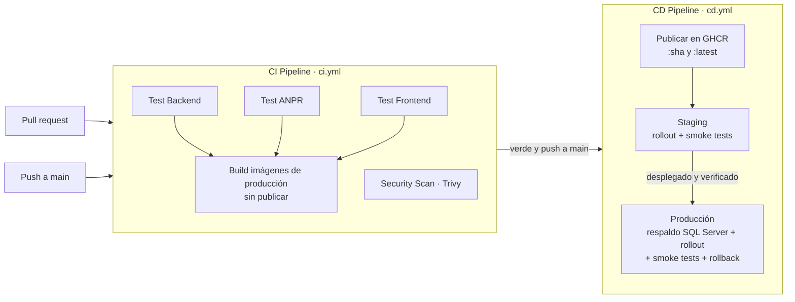

# CI/CD del sistema ANPR

Integración y entrega continuas con GitHub Actions, imágenes en GitHub Container Registry (GHCR) y
despliegue en Kubernetes con Kustomize.



| Archivo | Función |
|---|---|
| `.github/workflows/ci.yml` | Pruebas, escaneo de seguridad y construcción de las imágenes de producción |
| `.github/workflows/cd.yml` | Publicación de imágenes y orquestación staging → producción |
| `.github/workflows/deploy-k8s.yml` | Workflow reutilizable que despliega un entorno |
| `backend/Dockerfile.prod`, `frontend/Dockerfile.prod`, `frontend/nginx.conf` | Imágenes de producción (los `Dockerfile` sin sufijo siguen siendo los de desarrollo de `docker compose`) |
| `k8s/base`, `k8s/overlays/{staging,production}` | Manifiestos de Kubernetes |

## 1. CI (`ci.yml`)

Se ejecuta en cada push a `main`/`develop` y en cada pull request.

| Job | Qué verifica |
|---|---|
| Test Backend | `npm ci`, `tsc`, Jest (dominio, orquestación, integración RBAC, esquema) |
| Test ANPR Service | `pytest` del motor (configurado en `services/anpr/pytest.ini`) |
| Test Frontend | `tsc && vite build` |
| Security Scan | Trivy sobre el repositorio. Falla ante vulnerabilidades **críticas con corrección disponible**; el informe completo se sube como SARIF (repositorios públicos o con Advanced Security) o como artefacto `trivy-results` |
| Build Docker Images | Construye, sin publicar, las tres imágenes de producción que publicará el CD; comparte la caché de capas con el CD (`type=gha`, un scope por imagen) |

## 2. CD (`cd.yml`)

**Disparo:** al terminar en verde el CI de un *push* a `main` (`workflow_run`), o a mano
(*Run workflow*, con la opción de detenerse en staging). Los despliegues no se solapan: uno nuevo
espera al anterior (`concurrency`).

### 2.1 Publicación de imágenes

| Imagen | Origen | Contenido |
|---|---|---|
| `ghcr.io/<owner>/anpr-backend` | `backend/Dockerfile.prod` (contexto: raíz) | Node 20, `dist/` compilado, dependencias de producción, scripts `db/`, usuario sin root |
| `ghcr.io/<owner>/anpr-service` | `services/anpr/Dockerfile` | Motor FastAPI (en Kubernetes se ejecuta sin `--reload`) |
| `ghcr.io/<owner>/anpr-frontend` | `frontend/Dockerfile.prod` | Build de Vite servido por nginx sin root (puerto 8080); API en el mismo origen |

Etiquetas: el SHA del commit (inmutable, es la que se despliega) y `latest` (solo desde `main`). Se
publican con el `GITHUB_TOKEN` del workflow (`packages: write`); no hace falta ningún secreto.

### 2.2 Despliegue de un entorno (`deploy-k8s.yml`)

1. **Configuración.** Sin kubeconfig, el despliegue se **omite con un aviso** y el workflow queda en
   verde (las imágenes ya están publicadas). Con kubeconfig, comprueba que el overlay exista.
2. **Clúster.** Crea el namespace si falta y exige el Secret `anpr-secrets`; si no existe, falla con
   un mensaje que explica qué crear.
3. **Manifiestos.** `kustomize edit set image` fija las tres imágenes al SHA del commit, y luego
   `kustomize build`.
4. **Respaldo (solo producción).** `BACKUP DATABASE [ANPR_ECU911] … WITH CHECKSUM` en `db-0`, con
   un archivo con fecha y SHA en `/var/opt/mssql/backup/`. Se omite en el primer despliegue.
5. **Aplicación.** Crea el ConfigMap `mediamtx-config` desde `mediamtx/mediamtx.yml` y ejecuta
   `kubectl apply`.
6. **Rollouts.** Espera a db, redis, mediamtx, backend, frontend y motor (hasta 20 min para el motor
   por la primera carga de modelos).
   - **No hay paso de migración aparte:** el backend aplica `init.sql` y las migraciones al arrancar
     (registro `SchemaMigraciones` con SHA-256).
   - Su *startup probe* exige `/health`, así que el rollout termina con el esquema ya migrado.
7. **Smoke tests** contra la URL pública:
   - `/health` del backend, `/healthz` de nginx y la SPA;
   - `/api/auth/me` debe responder `401` (API viva y protegida).
8. **Rollback.** Si fallan los rollouts o los smoke tests, `kubectl rollout undo` de los tres
   Deployments.
   - La base **no** se restaura automáticamente: las migraciones son aditivas e idempotentes (la
     versión anterior funciona con el esquema nuevo), y una restauración perdería los ingresos
     registrados después del respaldo.
   - El resumen del job indica el archivo de respaldo por si hiciera falta restaurarlo a mano (§ 4).
9. **Slack** (opcional): resultado del despliegue si existe `SLACK_WEBHOOK`.

**Producción** solo se despliega si staging se desplegó de verdad (no omitido) y pasó sus smoke tests.
Para exigir aprobación manual, agregue *Required reviewers* al entorno `production` (Settings →
Environments).

## 3. Configuración

### 3.1 GitHub (Settings → Secrets and variables → Actions, o por entorno)

| Nombre | Tipo | Uso |
|---|---|---|
| `KUBE_CONFIG` (secreto del entorno `staging`/`production`) **o** `KUBE_CONFIG_STAGING` / `KUBE_CONFIG_PRODUCTION` (secretos de repositorio) | Secreto | kubeconfig del clúster, en texto plano o base64 (`base64 -w0 ~/.kube/config`). Sin él, ese entorno se omite |
| `SLACK_WEBHOOK` | Secreto (opcional) | Notificaciones de despliegue |
| `STAGING_URL`, `PRODUCTION_URL` | Variables (opcionales) | URL pública de los smoke tests (por omisión `https://staging.anpr.ecu911.gob.ec` y `https://anpr.ecu911.gob.ec`) |

Use una cuenta de servicio con permisos solo sobre su namespace en lugar de un kubeconfig de
administrador del clúster.

### 3.2 Kubernetes (una vez por namespace: `anpr-staging`, `anpr-production`)

```bash
NS=anpr-staging
kubectl create namespace $NS

# Secretos de la aplicación (obligatorio)
kubectl -n $NS create secret generic anpr-secrets \
  --from-literal=MSSQL_SA_PASSWORD='<contraseña fuerte>' \
  --from-literal=JWT_SECRET="$(python3 -c 'import secrets;print(secrets.token_urlsafe(48))')" \
  --from-literal=ANPR_SERVICE_TOKEN="$(python3 -c 'import secrets;print(secrets.token_urlsafe(32))')" \
  --from-literal=SMTP_PASSWORD='' \
  --from-literal=VAPID_PRIVATE_KEY=''

# Credenciales de GHCR si los paquetes son privados (token con read:packages)
kubectl -n $NS create secret docker-registry ghcr-pull \
  --docker-server=ghcr.io --docker-username=<usuario> --docker-password=<token>
```

Requisitos del clúster y valores a revisar en `k8s/overlays/<entorno>/kustomization.yaml`:

| Elemento | Detalle |
|---|---|
| Ingress | Controlador `ingress-nginx` y cert-manager con un ClusterIssuer `letsencrypt` (o ajuste la anotación). Tres hosts por entorno: la aplicación (`/`, `/api`, `/socket.io`, `/media`), `motor.` (vista previa del motor, `ANPR_PUBLIC_URL`) y `video.` (señalización WHEP, `WEBRTC_PUBLIC_URL`). Web Push exige https |
| Evidencia | PVC `anpr-media` en `ReadWriteMany`, compartido por backend y motor. En un clúster de un nodo puede usarse `ReadWriteOnce` |
| WebRTC | Service `mediamtx-webrtc` (LoadBalancer, 8189 UDP/TCP). Su IP pública va en `WEBRTC_HOSTS` |
| SQL Server | Staging usa la edición Developer y producción Express (gratuita, 10 GB por base). Con licencia, cambie `MSSQL_PID` a Standard o Enterprise |
| Correo y Web Push | `SMTP_*`, `VAPID_PUBLIC_KEY`. Si faltan las claves VAPID, el backend las genera y guarda en `ClavesServicio` |

Validación local de los manifiestos:

```bash
kustomize build k8s/overlays/staging | kubeconform -strict -summary
```

## 4. Restaurar un respaldo (manual)

```bash
NS=anpr-production
kubectl -n $NS exec db-0 -- ls /var/opt/mssql/backup
kubectl -n $NS scale deployment/anpr-backend deployment/anpr-service --replicas=0
kubectl -n $NS exec db-0 -- /bin/sh -c '/opt/mssql-tools18/bin/sqlcmd -S localhost -U sa -P "$MSSQL_SA_PASSWORD" -C -b -Q \
  "RESTORE DATABASE [ANPR_ECU911] FROM DISK = N'"'"'/var/opt/mssql/backup/<archivo>.bak'"'"' WITH REPLACE, CHECKSUM"'
kubectl -n $NS rollout undo deployment/anpr-backend   # si se vuelve a la versión anterior de la aplicación
kubectl -n $NS scale deployment/anpr-backend deployment/anpr-service --replicas=1
```

Copie los respaldos fuera del clúster (`kubectl cp`) según la política de retención institucional.

## 5. Comandos locales

```bash
# Pruebas
cd backend && npm test
cd services/anpr && pytest
cd frontend && npm run build

# Imágenes de producción (las mismas que construye el CI)
docker build -f backend/Dockerfile.prod -t anpr-backend .
docker build -t anpr-service services/anpr
docker build -f frontend/Dockerfile.prod -t anpr-frontend frontend

# Lint de los workflows
docker run --rm -v "$PWD:/repo" -w /repo rhysd/actionlint:latest
```

Para desarrollo se sigue usando `docker compose up --build` (Dockerfiles de desarrollo con recarga en
caliente).

## 6. Solución de problemas

| Síntoma | Causa probable |
|---|---|
| "Despliegue a staging omitido" | No hay kubeconfig configurado para el entorno (§ 3.1) |
| "Falta el Secret anpr-secrets" | Crear el Secret en el namespace (§ 3.2) |
| `ImagePullBackOff` | Paquetes de GHCR privados sin Secret `ghcr-pull`, o paquete sin acceso del token |
| Pods del backend/motor en `Pending` | El PVC `anpr-media` no se enlaza: StorageClass sin `ReadWriteMany` |
| El rollout del backend no termina | No conecta a SQL Server (contraseña del Secret o `db-0` no listo): `kubectl -n <ns> logs deploy/anpr-backend` |
| Smoke tests fallan con TLS o DNS | El host del overlay no apunta al Ingress o el certificado aún no se emite |
| Video sin imagen | `WEBRTC_HOSTS` no contiene la IP pública de `mediamtx-webrtc` o el puerto 8189 está bloqueado |
