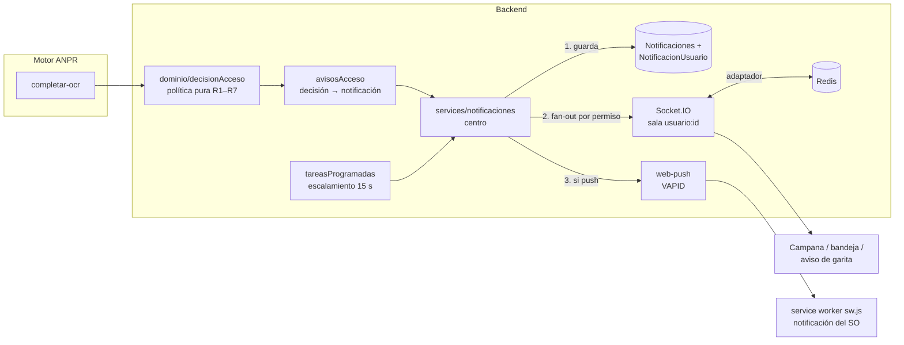
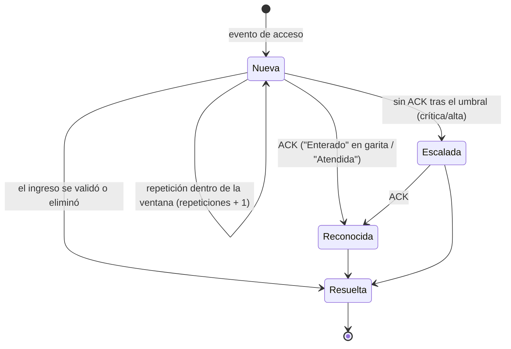

# Centro de notificaciones y alarmas

## 1. Requisitos

1. El **Operador** y el **Gestor de accesos** reciben alertas de accesos (vehículo sin permiso, permiso
   fuera de horario o vencido, placa en lista de alertas, posible placa clonada) en menos de 1 s.
2. Ninguna alarma se pierde si el navegador estuvo desconectado: se recupera al reconectar.
3. Las alarmas importantes llegan aunque la pestaña esté cerrada o en segundo plano.
4. Una alarma crítica sin atender no puede quedar en el olvido: se **escala**.
5. Evitar la fatiga de alarmas: el mismo evento repetido no genera N alarmas.
6. Medible para el artículo: latencia, tiempo de reconocimiento (TTA), tasa de escalamiento.

## 2. Decisión tecnológica: ¿SignalR?

ASP.NET Core SignalR es una biblioteca de tiempo real para servidores **.NET**; no existe un servidor
SignalR oficial para Node.js. Incorporarlo exigiría un servicio .NET adicional solo para transporte.
Se evaluaron las alternativas para el backend actual (Node.js + Express):

| Criterio | SignalR (.NET) | **Socket.IO** | SSE | WebSocket puro | MQTT | Firebase FCM | **Web Push (VAPID)** |
|---|---|---|---|---|---|---|---|
| Servidor en Node.js | ✗ (requiere .NET) | ✓ | ✓ | ✓ | broker aparte | servicio externo | ✓ (`web-push`) |
| Bidireccional | ✓ | ✓ | ✗ (solo servidor→cliente) | ✓ | ✓ | ✗ | ✗ |
| Grupos / salas | groups | rooms | manual | manual | topics | topics | — |
| Reconexión automática | ✓ | ✓ (+ recuperación de estado) | ✓ | manual | ✓ | — | — |
| Varias instancias | backplane Redis | **adaptador Redis** | manual | manual | broker | ✓ | ✓ |
| Pestaña cerrada | ✗ | ✗ | ✗ | ✗ | ✗ | ✓ (dependencia de Google) | ✓ (estándar W3C/IETF) |
| Ya en el proyecto | ✗ | ✓ | ✗ | ✗ | ✗ | ✗ | ✗ |

**Decisión:** Socket.IO es el equivalente funcional de SignalR en Node.js (hubs ≈ espacios de nombres,
groups ≈ salas, backplane ≈ adaptador Redis, reconexión con retroceso exponencial). Se complementa con
**Web Push estándar** (RFC 8030, cifrado RFC 8291, identificación del servidor VAPID RFC 8292), que
cubre lo que ningún canal de socket puede: entregar con la pestaña cerrada, sin depender de un
proveedor privativo, y con una **bandeja persistente** que garantiza la entrega "al menos una vez".

## 3. Arquitectura



- **Guardar antes de emitir:** cada notificación se escribe en la base antes de difundirse; el cliente
  recarga su bandeja al reconectar el socket y fusiona por id (entrega al menos una vez, sin
  duplicados visibles).
- **Fan-out por permiso:** un solo `INSERT … SELECT` asigna la notificación a los usuarios activos
  cuyos roles tienen el permiso del tipo (ver [ROLES_Y_PERMISOS.md](ROLES_Y_PERMISOS.md)).
- **Puertos y adaptadores:** la orquestación (`notificar()`) depende de una interfaz `Puertos` (SQL,
  Socket.IO, push, reloj); las pruebas la ejercitan con dobles en memoria.
- **Varias instancias:** el adaptador Redis reparte las emisiones entre réplicas del backend
  (verificado: una notificación originada en la instancia A llega a un cliente conectado a la B). El
  escalamiento toma cada alarma con `UPDATE … OUTPUT` atómico, así que se escala una sola vez.

## 4. Ciclo de vida de una alarma (ISA-18.2 / IEC 62682)



- **Reconocimiento global:** la primera persona que reconoce la alarma queda registrada como quien
  la atendió y la alarma deja de estar pendiente para todos. Se mide el tiempo de reconocimiento.
- **Escalamiento:** alarmas críticas/altas sin reconocer tras `notif_escalamiento_segundos`
  (90 s por omisión) generan `alarma.escalada` para Supervisor y Administrador (y correo opcional).
  La cota superior del tiempo sin atención es umbral + 15 s (periodo del barrido).
- **Supresión de avalanchas:** la misma clave (p. ej. `no_registrado:ABC1234`) dentro de la ventana
  del tipo incrementa `repeticiones` y vuelve a marcarla como no leída, en lugar de crear otra alarma.

## 5. Catálogo

| Tipo | Prioridad | Destinatarios (permiso) | ACK | Ventana | Push |
|---|---|---|:-:|---|:-:|
| `acceso.alerta_seguridad` | según nivel (crítica/alta/media) | `avisos:seguridad` | ✓ | 120 s | ✓ |
| `acceso.no_registrado` | alta | `avisos:acceso` (garita + gestor) | ✓ | 120 s | ✓ |
| `acceso.restringido` (fuera de horario, no vigente, vencido) | alta | `avisos:acceso` | ✓ | 120 s | ✓ |
| `acceso.vehiculo_no_coincide` (posible placa clonada) | alta | `avisos:acceso` | ✓ | 120 s | ✓ |
| `acceso.confirmacion` (lectura dudosa / confianza baja) | media | `avisos:garita` | ✓ | 120 s | |
| `acceso.reincidencia` (≥ N intentos en 24 h) | media | `padron:gestionar` | | 1/día | |
| `solicitud.nueva` | media | `solicitudes:resolver` (excepto el solicitante) | | | ✓ |
| `solicitud.resuelta` | baja | el solicitante | | | ✓ |
| `padron.por_vencer` (resumen diario) | baja | `padron:gestionar` | | 1/día | |
| `alarma.escalada` | crítica | `alarmas:escalamiento` | ✓ | | ✓ |
| `sistema.camara` (cámara sin conexión) | alta | `avisos:sistema` | | 15 min | ✓ |

## 6. API y eventos

| Método y ruta | Uso |
|---|---|
| `GET /api/notificaciones?limite&antes_de&desde&filtro=no_leidas\|pendientes` | Bandeja de la sesión |
| `GET /api/notificaciones/resumen` | `{ no_leidas, pendientes }` |
| `POST /api/notificaciones/:id/leer` · `POST /leer-todas` | Lectura |
| `POST /api/notificaciones/:id/reconocer` | ACK de una alarma |
| `POST /api/notificaciones/reconocer-deteccion/:id` | ACK de las alarmas de un paso (aviso de garita) |
| `GET /api/notificaciones/push/clave` | Clave pública VAPID |
| `POST`/`DELETE /api/notificaciones/push/suscripcion` | Alta/baja del navegador |
| `POST /api/notificaciones/push/prueba` | Push de prueba a los equipos del usuario |
| `GET /api/notificaciones/metricas?dias` | TTA, escalamiento, avalanchas (permiso `evaluacion:ver`) |

Eventos Socket.IO (sala `usuario:{id}`): `notificacion:nueva`, `notificacion:actualizada`
(repetición, ACK, resolución o escalamiento). Además: `solicitudes:actualizadas`.

## 7. Configuración

En **Configuración › Notificaciones** (o variables de entorno): `notif_escalamiento_segundos`,
`notif_escalamiento_correo`, `notif_reincidencia_umbral`, `notif_push_habilitado`, `notif_retencion_dias`.
Claves VAPID: `VAPID_PUBLIC_KEY`/`VAPID_PRIVATE_KEY`/`VAPID_SUBJECT`; si faltan, se generan y guardan en
`ClavesServicio`. **Web Push exige contexto seguro**: https o `http://localhost`; en la LAN publique el
frontend tras un proxy con TLS. En un puesto compartido, cerrar sesión desvincula el navegador de la cuenta.

## 8. Evaluación

**Indicadores** (Prometheus y `GET /api/notificaciones/metricas`, visibles en Evaluación del sistema):

| Indicador | Fuente | Referencia |
|---|---|---|
| Latencia captura → notificación | `anpr_notificacion_latencia_seconds` | objetivo < 1 s (p95) |
| Tiempo de reconocimiento (TTA) por prioridad | `anpr_notificacion_tiempo_reconocimiento_seconds`, mediana y p95 en SQL | — |
| Tasa de escalamiento | escaladas / alarmas con ACK | — |
| Alarmas por hora por operador | Notificaciones | ≈ 6/h régimen estable (ISA-18.2, EEMUA 191) |
| Ventanas de avalancha | > 10 alarmas altas/críticas en 10 min | ISA-18.2 |
| Repeticiones agrupadas | `anpr_notificaciones_suprimidas_total` | reducción de fatiga |

**Resultados de laboratorio** (contenedor Linux; Node.js 22; SQL Server 2022 Developer y Redis 7 en
Docker; adaptador Redis activo; sin inferencia de video, se mide el subsistema de decisión y
notificación; `backend/scripts/benchmark_notificaciones.js`, 200 pasos sin permiso, pausa 100 ms):

| Muestras | Entregadas | Media | p50 | p95 | p99 | Máx. |
|---:|---:|---:|---:|---:|---:|---:|
| 200 | 200 (100 %) | 33,2 ms | 31,5 ms | 40,3 ms | 61,4 ms | 71,1 ms |

Escalamiento con umbral de 20 s: la alarma se escaló a los 34 s (≤ umbral + 15 s) y llegó solo a
Supervisor y Administrador. Escalado horizontal: verificada la entrega entre dos instancias.

Reproducir:

```bash
cd backend
node scripts/benchmark_notificaciones.js --api http://localhost:5000 --servicio "$ANPR_SERVICE_TOKEN" \
     --email gestor@ecu911.gob.ec --password '…' --muestras 200 --csv latencias.csv
```

## Referencias

- ANSI/ISA-18.2-2016. *Management of Alarm Systems for the Process Industries*. IEC 62682:2014. EEMUA 191 (3.ª ed., 2013).
- Eugster, P. T., Felber, P. A., Guerraoui, R., & Kermarrec, A.-M. (2003). The many faces of publish/subscribe. *ACM Computing Surveys, 35*(2), 114–131.
- Fette, I., & Melnikov, A. (2011). *The WebSocket Protocol* (RFC 6455).
- Thomson, M., Damaggio, E., & Raymor, B. (2016). *Generic Event Delivery Using HTTP Push* (RFC 8030); Thomson, M. (2017). *Message Encryption for Web Push* (RFC 8291); Thomson, M., & Beverloo, P. (2017). *VAPID for Web Push* (RFC 8292).
- Sendelbach, S., & Funk, M. (2013). Alarm fatigue: A patient safety concern. *AACN Advanced Critical Care, 24*(4), 378–386.
