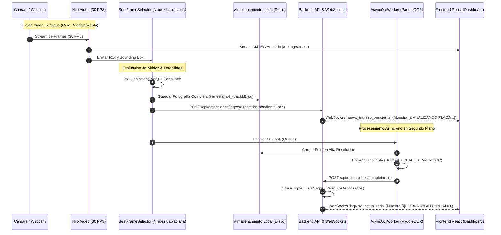

# Arquitectura ANPR de Dos Fases: Captura Fotográfica + PaddleOCR Asíncrono

## 1. Diagrama del Flujo Arquitectónico



---

## 2. Componentes y Archivos Modificados

| Componente | Archivo | Responsabilidad |
|---|---|---|
| **Base de Datos** | [`migration_deteccion_vehiculo.sql`](file:///c:/Users/ASUS/Desktop/TITULACION/ANPR/db/migration_deteccion_vehiculo.sql) | Esquema con campos de dos fases (`estado_procesamiento`, `ruta_imagen_ingreso`, `ruta_imagen_placa`, `placa_reconocida`, etc.). |
| **Backend Node.js** | [`aplicacion/detecciones.ts`](backend/src/aplicacion/detecciones.ts) | Casos de uso `ingreso` (Fase 1) y `completarOcr` (Fase 2) con cruce de listas y emisión de WebSockets; rutas en `interfaz/http/rutas/detecciones.ts`. |
| **Selector de Frame** | [`frame_selector.py`](file:///c:/Users/ASUS/Desktop/TITULACION/ANPR/services/anpr/app/aplicacion/frame_selector.py) | Cálculo de nitidez con varianza del Laplaciano, área, aspect ratio y debounce por tracking ID. |
| **Worker Asíncrono** | [`ocr_worker.py`](file:///c:/Users/ASUS/Desktop/TITULACION/ANPR/services/anpr/app/aplicacion/ocr_worker.py) | Proceso en segundo plano que ejecuta PaddleOCR y actualiza el backend fuera del hilo de video. |
| **Detector Liviano** | [`detector.py`](file:///c:/Users/ASUS/Desktop/TITULACION/ANPR/services/anpr/app/aplicacion/detector.py) | Inferencia YOLO liviana (~8ms) sin OCR en el bucle principal de captura. |
| **Microservicio FastAPI** | [`main.py`](file:///c:/Users/ASUS/Desktop/TITULACION/ANPR/services/anpr/app/main.py) | Orquestador desacoplado: Productor a 30 FPS + Consumidor de Frame Selection + Worker Queue. |
| **Frontend React** | [`Monitoreo.tsx`](frontend/src/interfaz/paginas/Monitoreo.tsx) | Video fluido a 30 FPS continuos + Feed reactivo con transición dinámica `[⏳ ANALIZANDO PLACA...]` ➔ `[🟢 AUTORIZADO]`. |

---

## 3. Instrucciones de Prueba y Verificación

1. **Terminal 1 — Backend (Node.js)**:
   ```bash
   cd backend
   npm run dev
   ```

2. **Terminal 2 — Microservicio ANPR (Python)**:
   ```bash
   cd services/anpr
   .\.venv\Scripts\python -m uvicorn app.main:app --host 0.0.0.0 --port 8000
   ```

3. **Terminal 3 — Frontend (React)**:
   ```bash
   cd frontend
   npm run dev
   ```

---

## 4. Mejoras de UI y Experiencia Visual Profesional

1. **Sidebar Negro Grafito Neutro (Cero Tinte Azul)**:
   - Paleta Zinc/Graphite ultra limpia (`#121214`, cabecera y pie `#0a0a0c`, bordes `#232326`, hovers `#1c1c20`).
   - Cero componente cromático azulado residual.
   - Botón de cierre de sesión con fondo neutro `#18181b` y hover en rojo institucional `#ef4444`.

2. **Alineación, Centrado y Espaciado Compacto del Dashboard**:
   - Margen y relleno armónico `padding: 24px 28px`, `maxWidth: 1750px` con `margin: 0 auto`.
   - **Corrección del espaciado excesivo**: Se eliminó el `minHeight: 'calc(100vh - 220px)'` del grid principal y se ajustó la alineación a `alignItems: 'start'` con una altura máxima del feed derecho a `540px`. Ahora la tabla queda inmediatamente ubicada debajo del video y del feed con una separación limpia y proporcionada (20px).
   - **Botón "Borrar" Individual en Cuadros de Detección**: Implementado en cada tarjeta del feed en vivo junto a "Validar", permitiendo eliminar capturas no deseadas tanto de la interfaz como de la base de datos de manera inmediata.

3. **Modal de Inspección Fotográfica Dual con Zoom Profesional ([`DualZoomModal.tsx`](file:///c:/Users/ASUS/Desktop/TITULACION/ANPR/frontend/src/components/DualZoomModal.tsx))**:
   - **Vista lado a lado (Doble Panel)**:
     - **Panel 1**: *Captura General del Vehículo* (perspectiva completa de la cámara de acceso).
     - **Panel 2**: *Recorte de Alta Resolución de la Placa* (detalle de la lectura OCR).
   - **Controles Interactivos de Zoom**:
     - **Zoom con Rueda del Ratón**: Escala suave desde 100% hasta 500% con scroll.
     - **Arrastre Panorámico (Pan / Drag)**: Al estar ampliada la imagen, se puede pulsar y arrastrar con el cursor para recorrer el detalle.
     - **Barra de Herramientas Flotante**: Botones de `[ + ]`, `[ - ]`, `[ ↺ 100% ]` y visualizador de porcentaje en tiempo real.
     - **Doble Clic**: Alterna rápidamente entre zoom 220% y 100%.
   - **Encabezado Institucional**:
     - Placa en tamaño destacado con tipografía monoespaciada y borde de estado.
     - Badges de estado (Lista Negra, Autorizado, Tránsito).
     - Indicador de confianza OCR, fecha/hora completa, vehículo y cámara.
     - Cierre mediante botón `X`, tecla `ESC` o clic fuera del modal.

4. **Comportamiento en el Navegador (`http://localhost:3000`)**:
   - El video corre a **60 FPS / 30 FPS en tiempo real continuo sin pausas ni latencia**.
   - **Rastreo a Larga Distancia (> 2 metros hasta 8.5 metros)**:
     1. El algoritmo ByteTrack + Kalman 2D detecta y engancha la caja en cuanto el vehículo entra al campo visual a distancia.
     2. El módulo de super-resolución bicúbica mejora los trazos de los caracteres lejanos.
     3. La etiqueta táctica formal muestra el estado institucional sin emoticones: **`[AUTORIZADO: PBA-5678]`** o **`[LISTA NEGRA: PBA-1234]`** o **`[PLACA: PBA-5678]`**.
